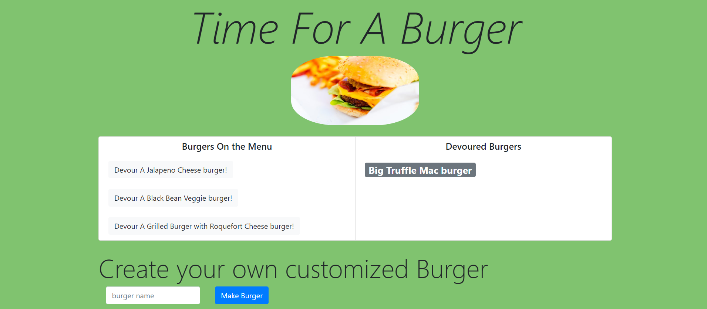

# `Burger Town`

A web app that functions as a burger logger with MySQL, Node, Express, Handlebars and a homemade ORM

* Each burger on the Menu card on the left hand side is waiting to be devoured. When you clicks it, the burger will move to the right side of the page.

* You can enter a new burger name in the input format the bottom and a new burger will be added to the "Burger on the Menu".

## App Deployment on Heroku

[Link to the Application](https://desolate-cliffs-89269.herokuapp.com)

App View

